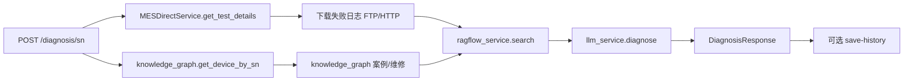
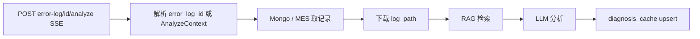
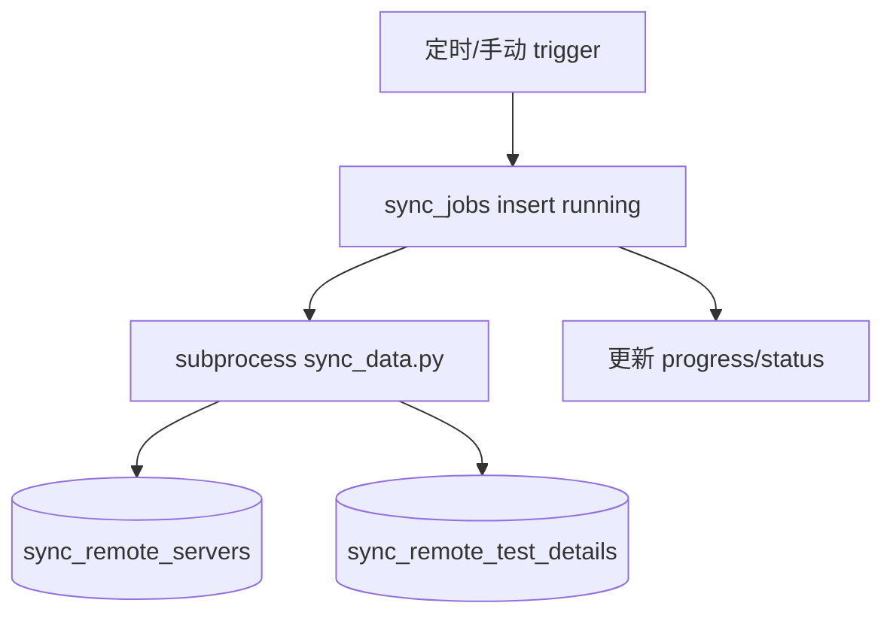
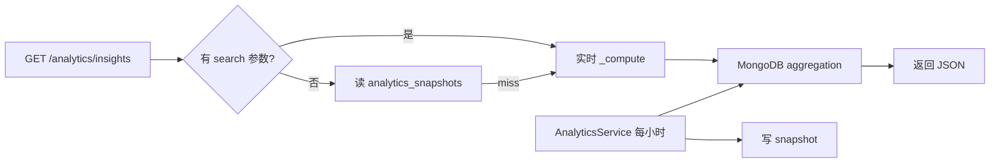

# 数据流

## SN 诊断数据流



## 异常日志智能剖析



前端可 POST `ErrorLogAnalyzeContext`，避免 MES 二次查询失败。

## 厂区 SIMS 同步



## 看板 insights



## 知识库上传

1. `POST /knowledge-base/documents` multipart
2. 写本地 `data/knowledge_base/`
3. 写 `knowledge_documents` 元数据
4. 若 RAGFlow 可用：upload → parse → 更新 status

## 认证流

```
register/login → users 集合 → JWT
后续请求 Authorization: Bearer → get_current_user → 解码 email → 查 users
```
