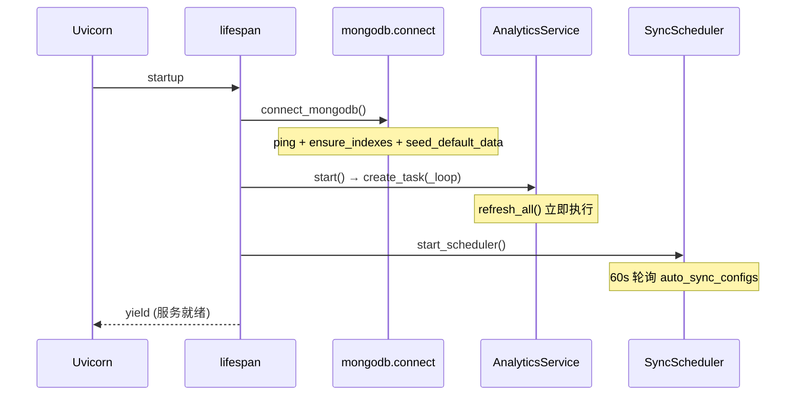

# 应用生命周期

实现：`app/core/lifespan.py`，挂载于 `FastAPI(lifespan=app_lifespan)`。

## 启动顺序



### 1. MongoDB 连接 (`connect_mongodb`)

```python
_client = AsyncIOMotorClient(settings.mongodb_uri)
_database = _client[settings.mongodb_db_name]
await _client.admin.command("ping")
await ensure_indexes(_database)
await seed_default_data(_database)
```

### 2. 分析调度器

```python
analytics_service = get_analytics_service()
analytics_service.start()  # asyncio.create_task(_loop)
```

`_loop` 先 `refresh_all()`，再每小时重复。

### 3. 同步调度器

```python
sync_scheduler = get_sync_scheduler_service()
sync_scheduler.start_scheduler()
```

独立 task 轮询 SIMS/MES 自动同步配置。

## 关闭顺序

```python
await sync_scheduler.stop_scheduler()
await analytics_service.stop()  # cancel task
await close_mongodb()
```

取消后台 task 避免 orphan subprocess（同步 job 仍在跑的需依赖进程退出）。

## 与 Uvicorn reload 交互

`--reload` 子进程重启会重复执行 startup。注意：

- 索引迁移应幂等（见 [索引策略](/database/indexes)）
- 两个进程短暂并存时，旧进程聚合可能与新进程索引操作冲突

## 健康检查

`GET /health` **不**验证 MongoDB，仅返回静态 JSON。若需深度健康检查可扩展 ping MongoDB。
