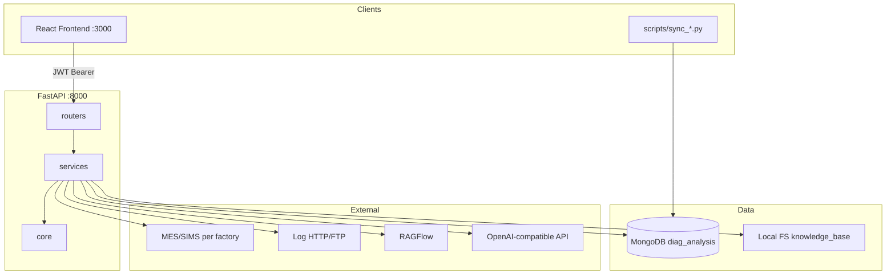

# 系统概览

WeaveEye 后端是 **单体 FastAPI 应用**，通过异步 I/O 连接 MongoDB、各厂区 MES/SIMS、RAGFlow 与 LLM API。

## 核心能力矩阵

| 能力 | 入口路由 | 核心服务 | 持久化 |
|------|----------|----------|--------|
| 用户认证 | `/api/auth/*` | `core/auth` | `users` |
| SN 诊断 | `/api/diagnosis/sn*` | `knowledge_graph`, `mes_direct`, `llm`, `ragflow` | `diagnosis_sn_history` |
| 异常剖析 | `/api/diagnosis/error-log/*` | 同上 + 日志下载 | `diagnosis_cache` |
| 异常看板 | `/api/error-logs/*`, `/api/sync/*` | `error_logs`, `sync` | `sync_remote_*` |
| 分析看板 | `/api/analytics/insights` | `analytics_service` | `analytics_snapshots` |
| 数据同步 | `/api/sync/*` | `sync_scheduler`, subprocess | `sync_jobs` |
| 知识库 | `/api/knowledge-base/*` | `ragflow_service` | `knowledge_documents` + 本地文件 |
| 全局 AI 配置 | `/api/settings/*` | — | `global_app_config` |

## 设计原则

1. **异步优先** — Motor + httpx，避免线程池阻塞事件循环
2. **配置外置** — 厂区 YAML + `.env`，AI 配置可入库
3. **脚本复用** — 重同步逻辑在 `scripts/`，后端只调度
4. **缓存换性能** — 看板快照、诊断 cache、SN 历史
5. **可选 RAGFlow** — 未部署 RAG 不影响核心链路
6. **幂等索引** — 启动 `create_index`，迁移才 drop

## 与前端契约

- 统一前缀 `/api`
- 多数业务响应 `{ success, data, error, message }`（`ApiResponse`）
- 诊断 SSE：`event: progress` / `event: result` / `event: error`
- MongoDB `_id` → JSON `id` 字符串

## 版本与 OpenAPI

- 应用版本：`app/main.py` `version="1.0.0"`
- 交互文档：`GET /docs`（Swagger）、`GET /redoc`
- OpenAPI JSON：`GET /openapi.json`
