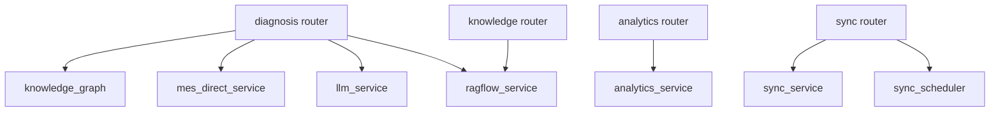

# 服务总览

`app/services/` 承载业务逻辑，被 routers 调用。

| 服务 | 文件 | 模式 |
|------|------|------|
| LLMService | `llm_service.py` | 模块单例 `llm_service` |
| KnowledgeGraphService | `knowledge_graph.py` | 模块单例 `knowledge_graph` |
| AnalyticsService | `analytics_service.py` | `get_analytics_service()` + 后台 task |
| SyncSchedulerService | `sync_scheduler_service.py` | `get_sync_scheduler_service()` |
| SyncService | `sync_service.py` | `get_sync_service()` |
| MESDirectService | `mes_direct_service.py` | 上下文管理器 |
| ragflow_service | `ragflow_service.py` | 函数模块 |
| ErrorLogsService | `error_logs_service.py` | `get_error_logs_service()` |

## 依赖关系

## 设计原则

- Service 不依赖 FastAPI Request
- 外部 HTTP 统一 httpx AsyncClient
- 长时间任务：asyncio task 或 subprocess，状态写 MongoDB
- 可选组件（RAGFlow）在 service 内 `_ok()` 短路

## 扩展新服务

1. 新建 `app/services/foo_service.py`
2. 如需单例，提供 `get_foo_service()`
3. 在 `app/services/__init__.py` 导出（可选）
4. Router 注入调用
