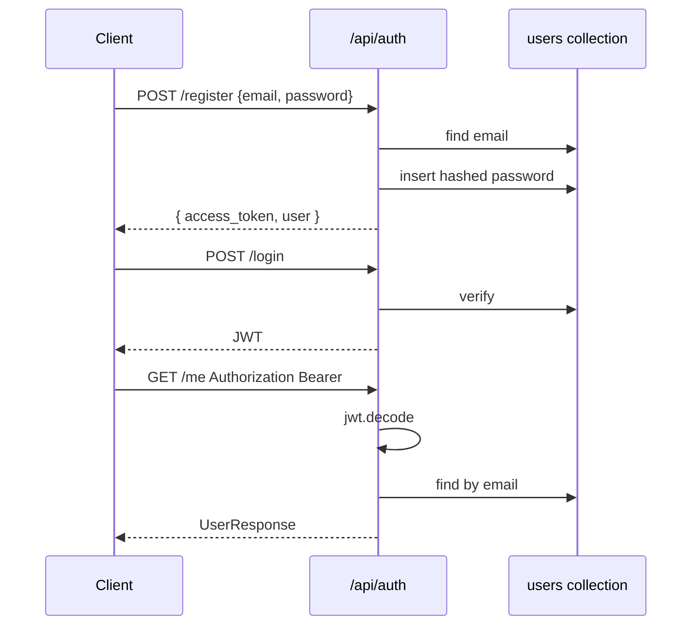

# JWT 认证工作流



## Token 存储（前端）

`localStorage` + `AuthContext`；后端无 session 表，纯 stateless JWT。

## 受保护路由

```python
@router.get("/...")
async def handler(user=Depends(get_current_user)):
    ...
```

## 安全清单

- [ ] 生产更换 JWT_SECRET_KEY
- [ ] HTTPS 传输
- [ ] 限制 CORS
- [ ] 密码强度（当前未强制，可扩展）
