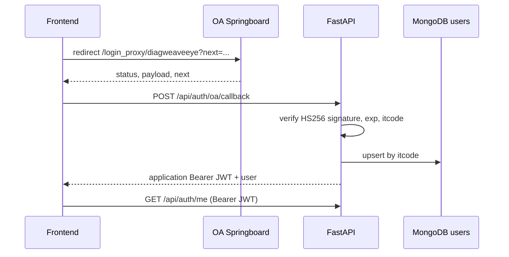

# OA 登录工作流

```mermaid
sequenceDiagram
  participant C as Frontend
  participant O as OA Springboard
  participant A as FastAPI
  participant U as MongoDB users
  C->>O: redirect /login_proxy/diagweaveeye?next=...
  O-->>C: status, payload, next
  C->>A: POST /api/auth/oa/callback
  A->>A: verify HS256 signature, exp, itcode
  A->>U: upsert by itcode
  A-->>C: application Bearer JWT + user
  C->>A: GET /api/auth/me (Bearer JWT)
```

- 发起登录时把一次性随机 state 写入 `next`；回调仅接受前端同源且 state 匹配的地址。
- 历史本地账号会在首次 OA 登录时按已验证邮箱绑定 `itcode`，保留原用户 ID。
- OA 错误不会自动循环重试；页面显示重新登录按钮。
- 主动退出清除应用 token，并暂停本次标签页的自动 OA 跳转。
